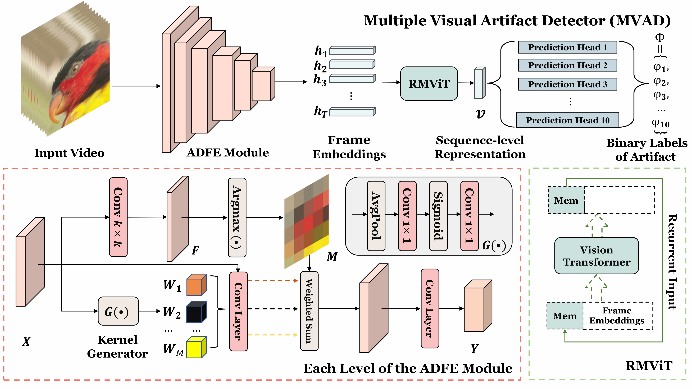

# MVAD: A Multiple Visual Artifact Detector for Video Streaming

MVAD: A Multiple Visual Artifact Detector for Video Streaming, <br>
 [Chen Feng](https://chenfeng-bristol.github.io/) <sup>1</sup>,
 [Duolikun Danier](https://danier97.github.io/) <sup>1</sup>,
 [Fan Zhang](https://fan-aaron-zhang.github.io/) <sup>1</sup>,
 [Alex Mackin](https://scholar.google.com/citations?user=7uqUCRUAAAAJ&hl) <sup>2</sup>,
 [Andrew Collins](https://scholar.google.com/citations?user=xT8vyCMAAAAJ&hl) <sup>2</sup>,
 [David Bull](https://david-bull.github.io/) <sup>1</sup>, <br>
 <sup>1</sup>Visual Information Laboratory, University of Bristol, Bristol, BS1 5DD, United Kingdom, <br>
 <sup>2</sup>Amazon Prime Video, 1 Principal Place, Worship Street, London, EC2A 2FA, United Kingdom

in IEEE/CVF Winter Conference on Applications of Computer Vision (WACV) 2025.

### [Paper](https://arxiv.org/pdf/2406.00212) | [Project](https://chenfeng-bristol.github.io/MVAD/) 


## Overview
We proposed a novel Multiple Visual Artifact Detector (MVAD) for video streaming. It comprises a new Artifact-aware Dynamic Feature Extractor (ADFE) and a Recurrent Memory Vision Transformer (RMViT) module to capture spatial and temporal information for multiple Prediction Heads. It outputs binary artifact predictions for the presence of ten common visual artifacts. We also developed a large and diverse training dataset based on Adversarial Data Augmentation to optimize the proposed model. This multi-artifact detector, MVAD, is the first of its type that does not rely on video quality assessment models. 

### Key Features
- A multi-artifact detection framework for 10 common video artifacts
- No reliance on traditional video quality assessment models
- Efficient architecture with ADFE and RMViT modules
- A large and diverse training dataset based on Adversarial Data Augmentation

### Framework
 

## Dependencies
### Installation
1. Clone this repository:
```bash
git clone https://github.com/ChenFeng-Bristol/MVAD.git
cd MVAD-main
```

2. Create conda environment with required packages:
```bash
conda env create -f environment.yaml
conda activate MVAD
```

3. Download the required [pre-trained model](https://drive.google.com/file/d/1hXYSVTWJCU1Z0PCEshbRzWStt6WLgAie/view?usp=sharing).

Optional steps:
* For experiment tracking during training, set up [weights and biases](https://docs.wandb.ai/guides/integrations/lightning):
  ```
  wandb login
  ```

### Pre-trained Model
The pre-trained model can be downloaded from [here](https://drive.google.com/file/d/1GAXaWmSPqrr9eR3IhfupbmsS8qgy7TG0/view?usp=sharing) and place it in the `logs/checkpoints/` directory., and its corresponding config file is [this yaml](./configs/fast_G8x7x7_F4x32x32_I1_bce_contrastive_fastInit_coslr_8xV100.yaml).

## Datasets
### Training dataset
Please fill the [registration form](https://forms.office.com/e/jdRHqABiBE) to get access to the download link. I will then share the download link ASAP.

### Data preparation
We provide tools to prepare your own training data. See [create_train_val_split.ipynb](create_train_val_split.ipynb) for details.

### Test dataset
### BVI-Artefact: [Paper](https://ieeexplore.ieee.org/stamp/stamp.jsp?tp=&arnumber=10566356) | [Project](https://chenfeng-bristol.github.io/BVI-Artefact/) 
Please fill the [registration form](https://forms.office.com/e/nVPNmiLuBk) to get access to the download link. I will then share the download link ASAP.


### Folder structures
The training dataset folder names should be as follows.
```
└──── <data directory>/
    ├──── labels.json
    ├──── val_split.json
    └──── avi/
        ├──── <video1>.avi
        ├──── ...
        └──── <videoN>.avi
```

The test set folder should look like:
```
└──── <data directory>/
    ├──── labels.json
    ├──── subsets.json
    └──── avi/
        ├──── <video1>.avi
        ├──── ...
        └──── <videoN>.avi
```

## Training
### Create config file.
1. Create config file based on [this](./configs/fast_G8x7x7_F4x32x32_I1_bce_contrastive_fastInit_8xV100.yaml), **following the naming convention**. 
2. Carefulling check all configs and updating any that needs updating.
3. Things most likely need updaing: **trainer configs, all directories**, etc.

### Train (fresh start)
```
python main.py --base <configs/your_config.yaml>
```
Optionally, use `-n` argument to specify name of experiment (you don't need to do this if the config file is named in a well descriptive way).

### Train (resume interrupted runs)
```
python main.py --base <configs/your_config.yaml> --resume <path/to/logdir/to/resume/from>
```

## Evaluation
```
python main.py --base <configs/your_config.yaml> --resume <path/to/ckpt> --test_only --test_name <name for the test>
```
Note that:

- `--resume` must be the path to the checkpoint you want to test.
- You can additionally specify test configs using command line arguments, and these will **overwrite** the ones in the config file you specify. For example, the command below runs a test with new testing configs that will overwrite what's specified in the yaml.
```
python -u main.py \
    --base configs/fast_G8x7x7_F4x32x32_I1_bce_contrastive_fastInit_coslr_8xV100.yaml \
    --resume logs/checkpoints/epoch=000012.ckpt \
    --test_only \
    --test_name nclips1_G8x14x14 \
    --data.params.test.params.data_dir=F:/data/BVI-Artefact \
    --data.params.train.params.data_dir=F:/data/BVI-Artefact-train \
    --data.params.validation.params.data_dir=F:/data/BVI-Artefact-train \
    --data.params.num_workers=6 \
    --lightning.callbacks.progress_bar.params.refresh_rate=1 \
    --data.params.test.params.sampling_config.fragments_h=14 \
    --data.params.test.params.sampling_config.fragments_w=14
```
- Give a descriptive name for `--test_name` that matches your test config.


### Checking the logs
Go to https://wandb.ai/ and go to your project (project name is the same as the local log folder name)

## Citation
If you find this work useful for your research, please cite:
```bibtex
@article{feng2024mvad,
  title={MVAD: A multiple visual artifact detector for video streaming},
  author={Feng, Chen and Danier, Duolikun and Zhang, Fan and Mackin, Alex and Collins, Andrew and Bull, David},
  journal={arXiv preprint arXiv:2406.00212},
  year={2024}
}
@inproceedings{feng2024bvi,
  title={BVI-Artefact: An artefact detection benchmark dataset for streamed videos},
  author={Feng, Chen and Danier, Duolikun and Zhang, Fan and Mackin, Alex and Collins, Andy and Bull, David},
  booktitle={2024 Picture Coding Symposium (PCS)},
  pages={1--5},
  year={2024},
  organization={IEEE}
}
}
```
If you find any bugs in the code, feel free to send me an email: chen.feng@bristol.ac.uk.

## License
This project is released under the [MIT License](LICENSE).

## Acknowledgments
The authors appreciate the funding from Amazon Research Award, Fall 2022 CFP and the UKRI MyWorld Strength in Places Programme (SIPF00006/1), the University of Bristol. Any opinions, findings, conclusions or recommendations expressed in this material are those of the author(s) and do not reflect the views of Amazon.